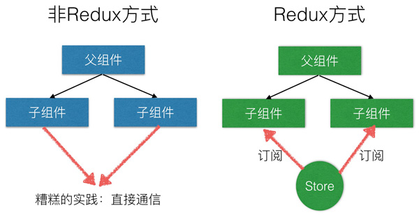
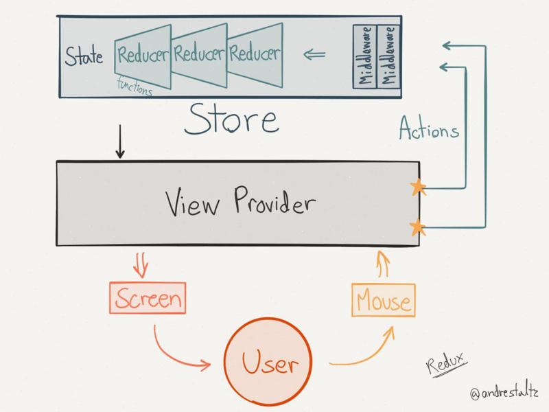
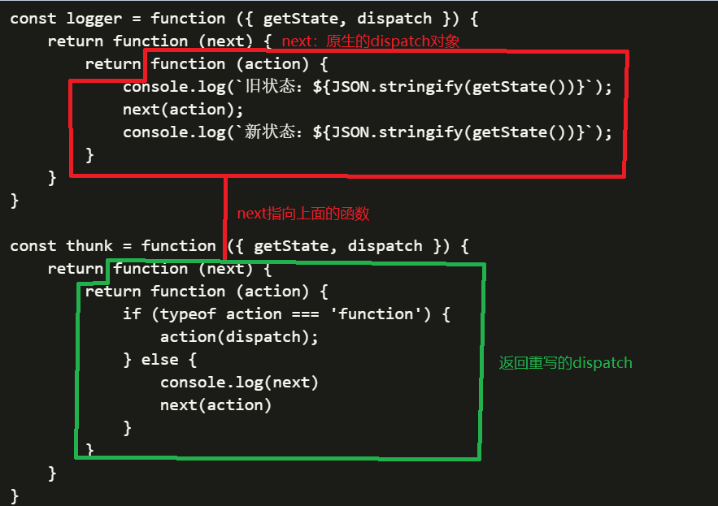

# Redux_Study

Redux 学习总结

## 需要解决的问题

“模块（组件）之间需要共享数据”，和“数据可能被任意修改导致不可预料的结果”之间的矛盾。

## 解决的方法

提高数据修改的门槛

## Redux应用场景

- 随着 JavaScript 单页应用开发日趋复杂,管理不断变化的 state 非常困难
- Redux的出现就是为了解决state里的数据问题
- 在React中，数据在组件中是单向流动的
- 数据从一个方向父组件流向子组件(通过props)，由于这个特征，两个非父子关系的组件（或者称作兄弟组件）之间的通信就比较麻烦

  

## Redux设计思想

- 单一数据源：整个应用的 state 被储存在一棵 object tree 中，并且这个 object tree 只存在于唯一一个 store 中
- State 是只读的：唯一改变 state 的方法就是派发（dispatch） action，action 是一个用于描述已发生事件的普通对象
- 使用纯函数来执行修改：为了描述 action 如何改变 state tree ，你需要编写 reducers
  - Reducer 只是一些纯函数，它接收先前的 state 和 action，并返回新的 state 
- 订阅事件：其它组件可以通过订阅（subscribe）store中的状态(state)来刷新自己的视图.  

  

## Redux概念解析

- Store
  - 就是保存数据的地方，你可以把它看成一个容器。整个应用只能有一个Store。
  - Redux 提供createStore这个函数，用来生成Store
  
   ```javascript
        import { createStore } from 'redux';
        const store = createStore(reducer);
   ```

- State
  - Store对象包含所有数据。如果想得到某个时点的数据，就要对 Store 生成快照。这种时点的数据集合，就叫做 State。当前时刻的 State，可以通过store.getState()拿到

  ```javascript
        import { createStore } from 'redux';
        const store = createStore(reducer);
        const state = store.getState();
   ```
  
- Action
  - 是把数据从应用传到 store 的有效载荷。它是 store 数据的唯一来源。一般来说你会通过 store.dispatch() 将 action 传到 store。
  - 我们应该尽量减少在 action 中传递的数据。
  - State的变化，会导致View的变化。但是，用户接触不到 State，只能接触到View 所以，State的变化必须是 View导致的。Action 就是 View 发出的通知，表示State 应该要发生变化了。 Action是一个对象。其中的type属性是必须的，表示 Action 的名称。其他属性可以自由设置。

  ```javascript
        const ADD_TODO = 'ADD_TODO'
        {
          type: ADD_TODO,
          text: 'Learn Redux'
        }
  ```

- Action Creator
  - View 要发送多少种消息，就会有多少种 Action。如果都手写，会很麻烦。可以定义一个函数来生成 Action，这个函数就叫 Action Creator
  - 在 Redux 中的 action 创建函数只是简单的返回一个 action:

  ```javascript
        function addTodo(text) {
          return {
            type: ADD_TODO,
            text
          }
        }
  ```

- store.dispatch
  - View 发出 Action 的唯一方法
  
  ```javascript
        import { createStore } from 'redux';
        const store = createStore(fn);

        store.dispatch({
          type: 'ADD_TODO',
          text: 'Learn Redux'
        });
  ```

- Reducer
  - Store 收到 Action 以后，必须给出一个新的 State，这样 View 才会发生变化。这种 State 的计算过程就叫做 Reducer。
  - Reducer 是一个纯函数，它接受 Action 和当前 State 作为参数，返回一个新的 State。
    - 纯函数
      - 函数的返回结果只依赖于它的参数，相同的输入产生相同的输出
      - 对外层作用域不会产生副作用
  
  ```javascript
        const reducer = function (state, action) {
          // ...
          return new_state;
        };
  ```

## Redux middleware



- 不使用middleware时，在dispatch(action)时会执行Reducer，并根据action的type更新返回相应的state。
- 而在使用middleware时，简言之，middleware会将我们当前的action做相应的处理，随后再交付Reducer执行
- 通过重写dispatch方法，在派发action之前或之后添加逻辑（AOP）。 你可以利用 Redux middleware 来进行日志记录、创建崩溃报告、调用异步接口或者路由等等。每一个 middleware 处理一个相对独立的业务需求，通过串联不同的 middleware，实现变化多样的的功能。

### applyMiddleware分析

  ```script
  import { createStore } from 'redux';
  import reducer from './reducers';
  const logger = function ({ getState, dispatch }) {
      return function (next) {
          return function (action) {
              console.log(`旧状态：${JSON.stringify(getState())}`);
              next(action);
              console.log(`新状态：${JSON.stringify(getState())}`);
          }
      }
  }
  const thunk = function ({ getState, dispatch }) {
      return function (next) {
          return function (action) {
              if (typeof action === 'function') {
                  action(dispatch);
              } else {
                  console.log(next)
                  next(action)
              }
          }
      }
  }
  function applyMiddleware(...middlewares) {
      return function (createStore) {
          return function (...args) {
              let store = createStore(...args);
              let dispatch;
              let middlewareAPI = {
                  getState: store.getState,
                  dispatch: (...args) => dispatch(...args)
              };
              const chain = middlewares.map(middleware => middleware(middlewareAPI));
              dispatch = compose(...chain)(store.dispatch);
              return {
                  ...store,
                  dispatch
              };
          }
      }
  }
  function compose(...funcs) {
      if (funcs.length === 0) {
          return arg => arg
      }
      if (funcs.length === 1) {
          return funcs[0]
      }
      return funcs.reduce((a, b) => (...args) => a(b(...args)))
  }

  let store = applyMiddleware(thunk, logger)(createStore)(reducer);
  // let store = createStore(reducer, applyMiddleware(thunk, logger));
  export default store;

  ```

- 1、依次执行middleware：将middleware执行后返回的函数合并到一个chain数组，这里我们有必要看看标准middleware的定义格式，如下
  - ```const chain = middlewares.map(middleware => middleware(middlewareAPI))```
  
    ```script
    export default ({ dispatch, getState }) => next => action => {}

    // 即
    function ({ dispatch, getState }) {
        return function(next) {
            return function (action) {
                return {}
            }
        }
    }
    ```

    那么此时合并的chain结构如下

    ```script
    [    ...,
        function(next) {
            return function (action) {
                return {}
            }
        }
    ]
    ```

- 2、改变dispatch指向：compose函数，实际就是一个柯里化函数，即将所有的middleware合并成一个middleware，并在最后一个middleware中传入当前的dispatch
  - ```dispatch = compose(...chain)(store.dispatch)``` 返回重写的dispatch
    

- 3、触发action，执行过程如下

    ```script
    asyncAdd(){
        //在redux中派发的动作只能是纯对象，并不能函数 store.dispatch
       return function(dispatch){
           setTimeout(() => {
                dispatch({type:types.ADD});
           }, 1000);
       }
    },
    ```

    执行重写的dispatch函数，当前action是一个函数，执行action(dispatch)。执行setTimeout，1秒钟之后执行dispatch({type:types.ADD});当前dispatch指向重写的dispatch。递归指向重写的dispatch函数，当前action是一个对象，执行next(action)，当前next指向红框的函数，最终打印状态数据，派发actions触发状态更新
  